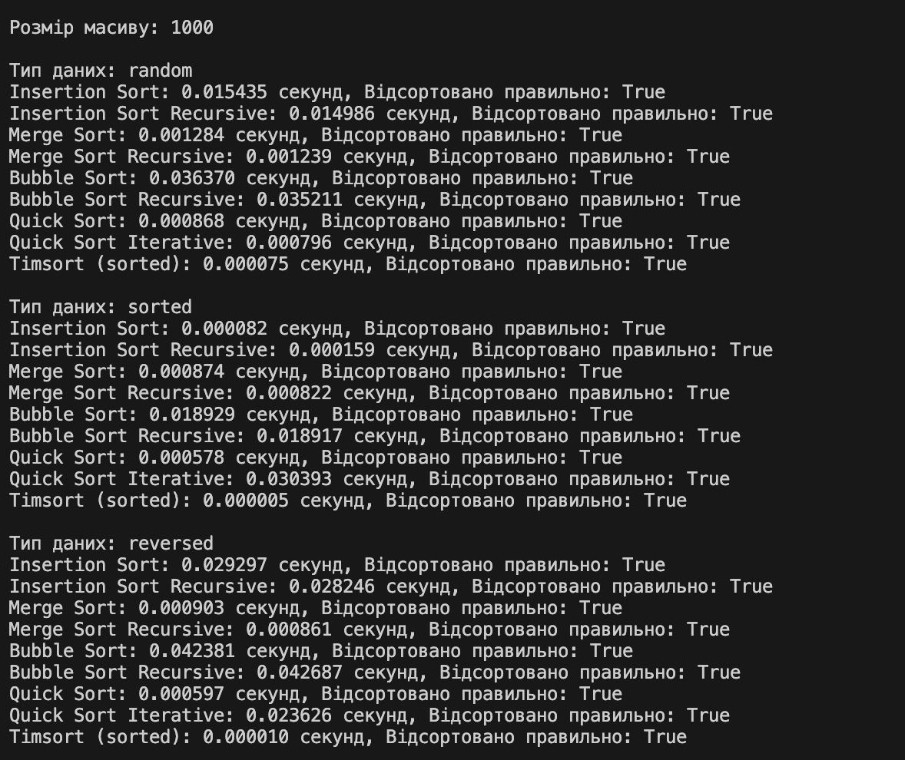
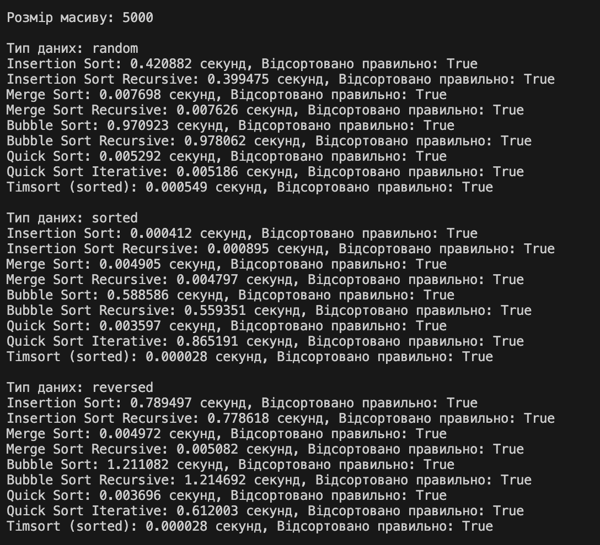
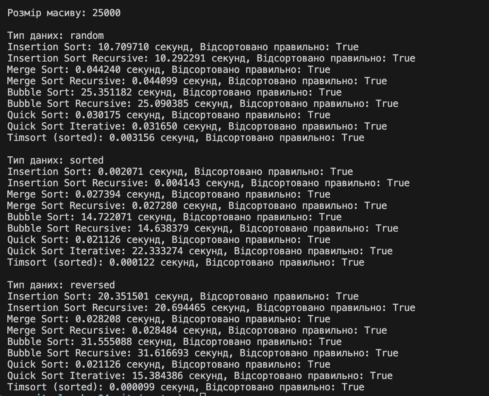

# goit-algo-hw-04
# використаний код з конспеку лекції:
https://github.com/goitacademy/Basic-Algorithms-and-Data-Structures-Neoversity/tree/main/sorting

## Порівняльний аналіз алгоритмів сортування

# Емпіричний аналіз наступних алгоритмів сортування:
	•	Insertion Sort (ітеративний та рекурсивний)
	•	Merge Sort (ітеративний та рекурсивний)
	•	Bubble Sort (ітеративний та рекурсивний)
	•	Quick Sort (рекурсивний та ітеративний)
	•	Timsort (вбудована функція sorted() в Python)

# Тестування виконувалося на масивах розміром 1000, 5000 та 25000 елементів з трьома типами даних:
	•	random: випадкові дані
	•	sorted: відсортовані дані
	•	reversed: дані, відсортовані у зворотному порядку

  
  
  

# Аналіз результатів:

1. Insertion Sort (Сортування вставками):
	•	Часова складність: O(n²)
	•	На малих масивах (1000 елементів) працює відносно швидко на випадкових даних.
	•	На відсортованих даних працює дуже швидко, особливо при збільшенні розміру масиву.
	•	На даних, відсортованих у зворотному порядку, час виконання значно зростає.
	•	На великих масивах (25000 елементів) час виконання стає дуже великим, особливо на випадкових та зворотних даних (понад 10 секунд).

2. Merge Sort (Сортування злиттям):
	•	Часова складність: O(n log n)
	•	Показує стабільний та швидкий час виконання на всіх типах даних.
	•	Час виконання зростає логарифмічно з ростом розміру масиву.
	•	Незалежно від початкового стану даних (випадкові, відсортовані, зворотні), час виконання залишається подібним.

3. Quick Sort (Швидке сортування):
	•	Часова складність: O(n log n) в середньому, O(n²) у найгіршому випадку.
	•	Рекурсивна версія працює дуже швидко на всіх типах даних та розмірах масивів.
	•	Ітеративна версія має більший час виконання на відсортованих та зворотних даних, особливо на великих масивах.
	•	На випадкових даних ітеративна та рекурсивна версії мають подібний час виконання.

4. Bubble Sort (Сортування бульбашкою):
	•	Часова складність: O(n²)
	•	Повільний алгоритм, особливо на великих масивах.
	•	На відсортованих даних час виконання дещо зменшується, але все ще залишається високим.
	•	На масиві розміром 25000 елементів час виконання перевищує 25 секунд.

5. Timsort (вбудована функція sorted()):
	•	Часова складність: O(n log n) в середньому та найгіршому випадку, O(n) у найкращому випадку (відсортовані дані).
	•	Найшвидший алгоритм на всіх типах даних та розмірах масивів.
	•	Час виконання на відсортованих даних мінімальний (0.000004 секунди).
	•	Показує відмінну продуктивність навіть на великих масивах.

# Висновки
	•	Timsort є найбільш ефективним алгоритмом серед протестованих. Він поєднує в собі переваги сортування злиттям та сортування вставками, що робить його надзвичайно швидким на практиці.
	•	Сортування вставками підходить для малих масивів або майже відсортованих даних, але стає неефективним на великих наборах даних через квадратичну складність.
	•	Сортування злиттям демонструє стабільну продуктивність незалежно від початкового стану даних, але все ж поступається Timsort.
	•	Швидке сортування працює швидко на випадкових даних, але його продуктивність може погіршуватися на певних наборах даних (наприклад, відсортованих або реверснутих), особливо для ітеративної версії, виглядає, як аномалія, за рахунок створення стеків, та додаткових операцій.
	•	Сортування бульбашкою є найбільш неефективним алгоритмом серед протестованих, особливо на великих масивах.

## Поєднання сортування злиттям та сортування вставками в алгоритмі Timsort робить його значно ефективнішим за інші алгоритми.
